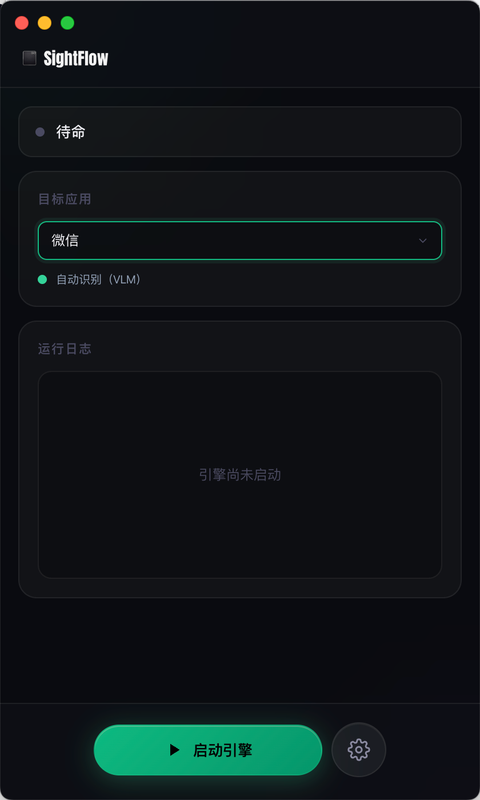
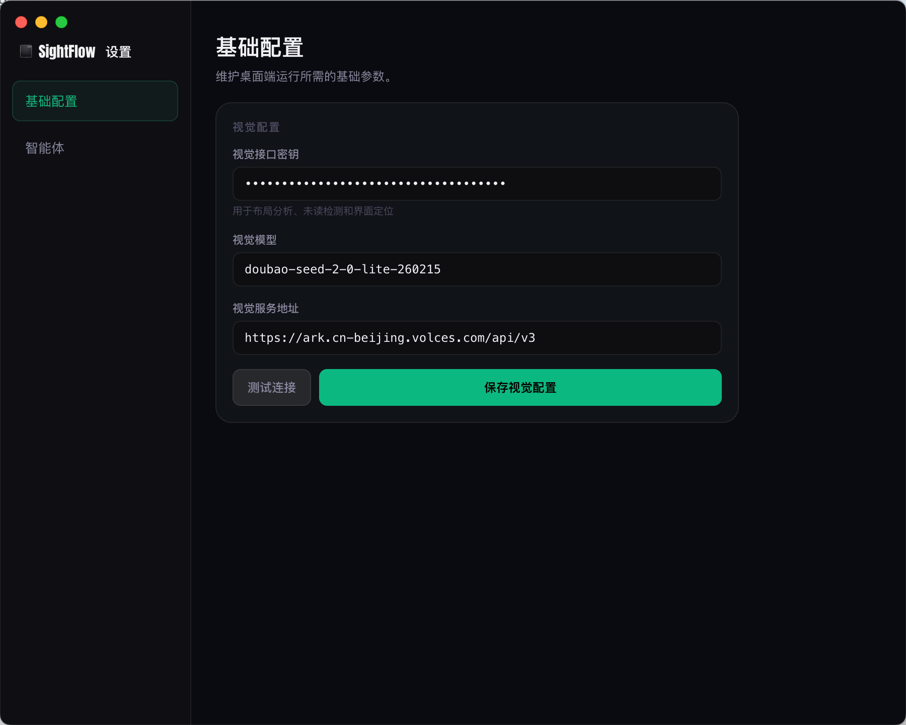
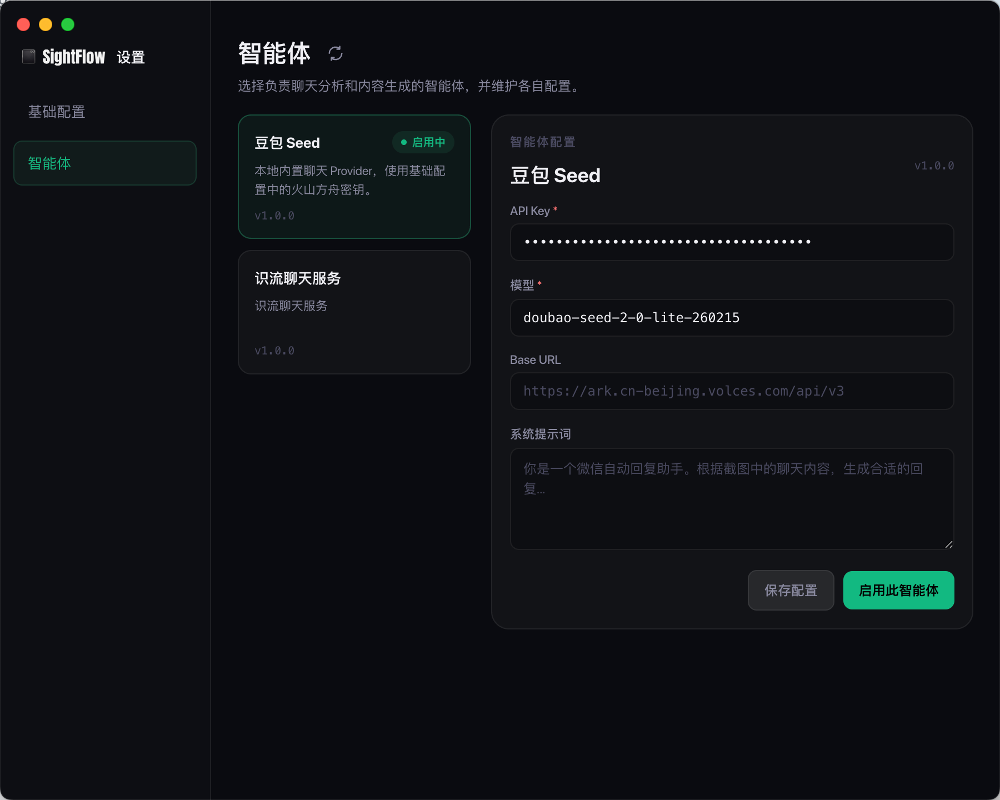

# SightFlow.dev

<p align="right"><a href="./README.md">中文</a> · <b>English</b></p>


Official website: [https://sightflow.dev](https://sightflow.dev/)

# Looking for co-builders

We believe Agent Computer Use will be a key piece of infrastructure for the major AI revolution of the next decade. If you'd like to help iterate on this project, get in touch.

[Join Discord](https://discord.com/invite/8H6KpbXq3t)

## Overview

SightFlow is a cross-platform desktop RPA client built on Electron and a Vision Language Model (VLM). It breaks "getting work done on the screen" into a four-stage loop:

- **See** — Screenshot + VLM visual grounding to recognize the chat window layout and unread messages.
- **Think** — Hand the chat screenshot to an agent (Provider) for analysis and natural reply generation.
- **Do** — Pure-vision RPA: move the mouse, click, paste, and send, with no need to integrate any app API.
- **Learn** — Record every run as a replayable, structured trace, distill it into experience cards, and reuse them on the next run.

## 🔑 AI model & agent configuration

This project relies on a large language / vision model (VLM) to drive RPA. The desktop configuration has two layers:

- **Base config** — Your Volcengine Ark API key, used for visual grounding, the built-in Doubao agent, and other base capabilities.
- **Agent** — Choose the Provider responsible for chat analysis and reply generation, and maintain its own config.

### What the API key is used for

1. **Smart reply generation** — Because the project automates apps like WeChat, the model analyzes a screenshot of the chat UI and generates a natural reply (with a guard against self-looping conversations).
2. **VLM visual grounding** — Given a screenshot and a task-specific prompt, the model detects on-screen UI controls and returns the coordinates to click, driving a fully vision-based RPA flow.

### How to configure

1. Go to the [Volcengine Console — Ark native API](https://console.volcengine.com/ark) to enable the service and generate/obtain your API key.
2. After launching the app, click the settings button at the bottom-right of the main window to open the dedicated settings window.
3. Fill in your API key under **Base config**. The default Base URL is `https://ark.cn-beijing.volces.com/api/v3` and usually needs no change.
4. Pick the active Provider under **Agent**. The built-in default agent is **Doubao Seed**, with the model fixed at `doubao-seed-2-0-lite-260215`.

### Screenshots

| Main window                                                                  | Base config                                                                           | Agent config                                                                               |
| ---------------------------------------------------------------------------- | ------------------------------------------------------------------------------------- | ------------------------------------------------------------------------------------------ |
|  |  |  |

## Target apps & box-select mode

The main window offers a **target app** quick setting that determines how the desktop client measures the chat window layout:

- WeChat and WeCom (Work WeChat) use VLM auto-detection of window regions by default.
- DingTalk, Feishu/Lark, Slack, Telegram, and other desktop apps default to manual box-select.
- When the target app requires box-select, click **Start box-select** and frame the 3 regions in order: the conversation list, the chat content area, and the input box.
- Box-select results are saved locally per target app; later launches reuse the saved regions, and you can re-run box-select at any time.

VLM and box-select only affect _how the layout is measured_. Runtime screenshotting, content analysis, reply generation, and message sending all consume the same layout result.

## Agent / Provider Hub

The SightFlow desktop client abstracts the "analyze a screenshot and generate a reply" capability into a standalone Provider. A Provider declares its config structure via `manifest.json` and, through its bundle entry, receives chat screenshots and emits events such as `reply_text`, `skip`, and `error`.

The app ships with a simple Provider Hub:

- By default it fetches the candidate Provider list from `https://sightflow.dev/provider-hub.json` (override with the `SIGHTFLOW_PROVIDER_HUB_URL` environment variable).
- The hub only tracks each Provider's `manifestUrl`; the fields shown in the UI come from each Provider's own manifest.
- After the first load it caches locally; unless you manually click the refresh button next to the Agent title, the local cache is used first.
- The built-in **Doubao Seed** is always kept locally as the default Provider, so there is still an option when the remote list is unavailable.

For the external Provider integration guide, see: [Chat Provider integration docs](./docs/provider.en.md).

The repository still ships a Doubao / Volcengine Ark Provider example for reference in the integration docs and local development:

```text
resources/providers/volcengine-ark/manifest.json
resources/providers/volcengine-ark/provider.bundle.js
```

## 🧠 Work Memory (Learn)

Every run is recorded as a **structured work trace** rather than a handful of text log lines. The **Work Memory** button at the bottom-right of the main window opens a dedicated Work Memory window with two views:

- **Traces** — A session list on the left and a timeline on the right. Each step is tagged with its phase (observe / think / act / verify), the screenshot at that moment, the reasoning, the action taken, and a success / fail / skip badge; the timeline refreshes live while the engine runs.
- **Step-by-step replay** — Drag the slider to replay a session frame by frame and review _why_ the agent did what it did. This is a **visual replay** — it does not actually re-drive the mouse or keyboard, so there is zero risk.
- **Experience cards** — Click **"Learn from this trace"** to have the model distill the trace into 1–3 experience cards (scenario / guidance / rationale). You can also click **"Correct"** on a step to capture a human fix as a `human_takeover` card.
- **Runtime injection** — Enabled experience cards are injected into the Provider's prompt on the next run; cards that get used are marked **"📎 experience"** on the trace, and their reference count and success rate are tracked automatically so you can measure whether an experience actually helps.

All traces and experience cards are stored locally (`<userData>/worktrace/`) and never leave the machine. For the capability roadmap, see [the Learn capability plan](./docs/plan/learn-work-memory-plan.md) (Chinese).

## 🌐 Localized UI

The app ships with both Chinese and English UI copy, switchable in the settings window; the language preference is persisted locally.

## 🚀 Quick start (Project Setup)

### 1. Install dependencies

```bash
npm install
```

### 2. Run in development

```bash
npm run dev
```

> **Tip**: After launch the app opens the main window. First pick the target app and finish any required box-select, then open the settings window to fill in the API key and confirm the active Provider.

## 📦 Build

```bash
# Build for Windows
npm run build:win

# Build for macOS
npm run build:mac

```

## Recommended dev setup

- [VSCode](https://code.visualstudio.com/) + [ESLint](https://marketplace.visualstudio.com/items?itemName=dbaeumer.vscode-eslint) + [Prettier](https://marketplace.visualstudio.com/items?itemName=esbenp.prettier-vscode)
